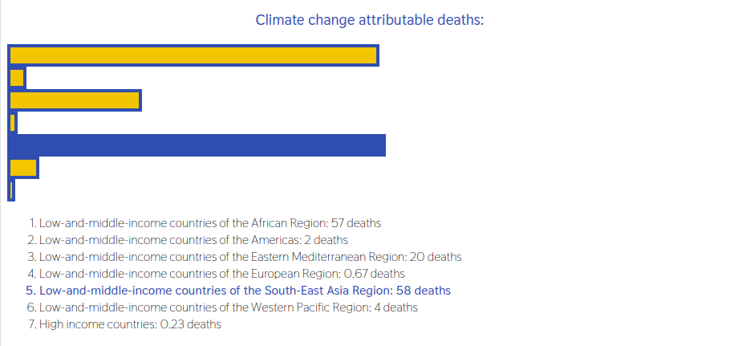

# Climate Change Burden of Disease Visualisation

This is a very small project to learn d3. This code follows the Codecademy freeform project 'Climate Change Burden of Disease Visualisation'. The data used describes "climate change attributable deaths" in different regions, from the [World Health Organisation](https://apps.who.int/gho/data/node.wrapper.imr?x-id=2391).

The project features a bar chart of deaths in different regions with an accompanying legend. If a user hovers over a bar the bar itself and it's corresponding text highlight, and vice versa.

## Screenshot
